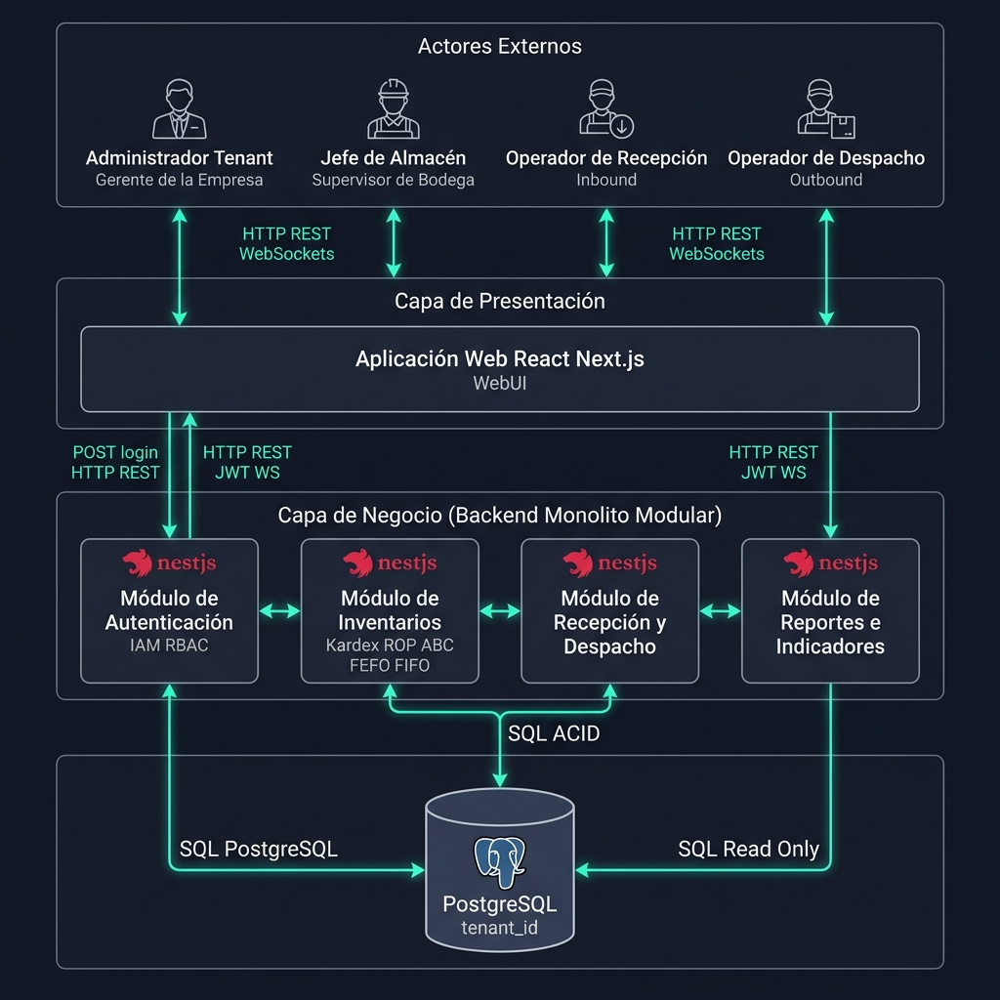
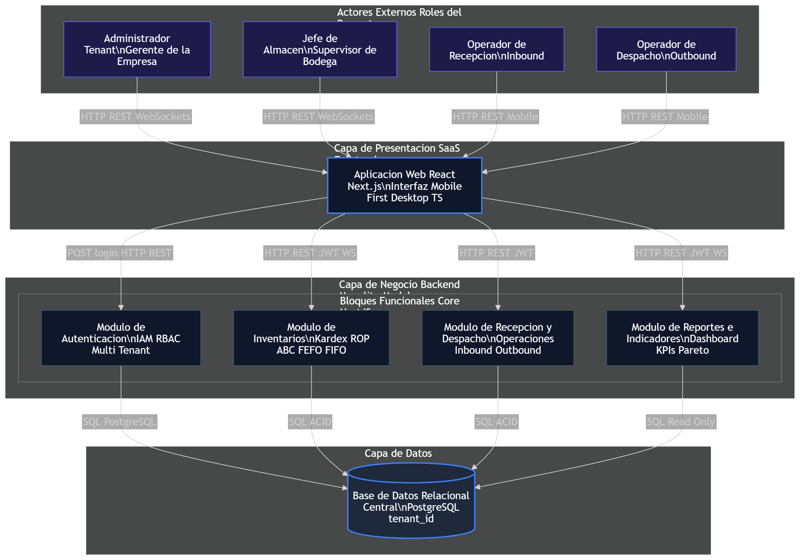

# Diagrama de Arquitectura de Alto Nivel
**Proyecto:** Krevo SaaS - Warehouse Management System (WMS)
**Fase:** Corte 1 (Análisis y Arquitectura Base)

Este documento constituye el entregable central de la arquitectura de software del sistema **Krevo WMS SaaS**. Como "firma del arquitecto", este artefacto está diseñado para ser comprendido por cualquier persona externa al equipo técnico (como los estudiantes de Ingeniería Industrial que actúan como *Product Owners*) en menos de dos minutos.

---

## 1. Justificación de la Visión Arquitectónica

Para responder de manera efectiva a las necesidades de los Centros de Distribución (CEDI) de la región bajo el modelo de formación dual, la arquitectura del software de **Krevo** se ha diseñado bajo el patrón de **Monolito Modular** en el Backend y una **Arquitectura Basada en Componentes** en el Frontend.

Esta decisión está directamente alineada con las restricciones y realidades del proyecto:
*   **Restricciones de Tiempo:** Cronograma estricto de **6 semanas** para la entrega final.
*   **Capacidad del Equipo:** Equipo de **4 desarrolladores** (2 dedicados a Frontend con Next.js y 2 a Backend con NestJS).
*   **Objetivo de Calidad:** Garantizar un alto rendimiento (<500ms de respuesta) y mantenibilidad sin incurrir en la sobrecarga operativa, de red y de despliegue que requeriría una arquitectura de microservicios.

---

## 2. Diagrama de Arquitectura de Alto Nivel

El siguiente diagrama de contenedores y bloques funcionales ilustra el flujo de información, los límites lógicos del sistema y las tecnologías nucleares utilizadas:

### Diagrama de Referencia de Arquitectura (Boceto Estructural)

---

## 3. Elementos Representados en el Diagrama

### A. Actores Externos (Los 4 Roles Obligatorios)
*   **Administrador Tenant:** Configura los parámetros espaciales del CEDI, define el catálogo de artículos, establece costos de ordenamiento y almacenamiento ($S$ y $H$), y gestiona la suscripción corporativa del SaaS.
*   **Jefe de Almacén:** Supervisa la operación logística, analiza el dashboard gerencial (KPIs, rotación, gráfico de Pareto), aprueba traslados entre bodegas e inspecciona alertas de desabastecimiento (ROP).
*   **Operador de Recepción:** Ejecuta las tareas operativas de entrada física de mercancía (Inbound), validando lotes y fechas de vencimiento contra facturas o remisiones del proveedor.
*   **Operador de Despacho:** Realiza las actividades de alistamiento de pedidos (Picking) y salida de stock (Outbound), confirmando ubicaciones en estantes y asegurando el cumplimiento estricto de las políticas FIFO/FEFO.

### B. Bloques Funcionales (Módulos Core)
*   **Módulo de Autenticación (IAM):** Encargado del registro de usuarios, control de acceso basado en roles (RBAC) y la validación inmutable del aislamiento multi-tenant mediante la inyección y verificación del token JWT que contiene el discriminador `tenant_id`.
*   **Módulo de Inventarios (WMS):** Administra el Kárdex digital de movimientos de stock, valida políticas FIFO/FEFO, y calcula de manera dinámica los puntos de reorden (ROP), la clasificación ABC mensual de SKUs y los inventarios de seguridad bajo modelos probabilísticos.
*   **Módulo de Recepción y Despacho (Operaciones):** Controla el flujo de trabajo físico en el CEDI. Implementa el registro de ingresos (Inbound), solicitudes de transferencia interna, confirmación de picking por operarios y el despacho final (Outbound).
*   **Módulo de Reportes e Indicadores (BI):** Consolida datos transaccionales para presentarlos gráficamente en tiempo real (vía WebSockets). Genera la curva de Pareto (80/20) y exporta datos consolidados a formatos CSV, PDF y Excel.

### C. Fuentes de Datos
*   **Base de Datos Relacional Central (PostgreSQL):** Funciona como el cilindro centralizador de datos persistentes del sistema. Almacena las tablas relacionales de la jerarquía espacial (Bodegas, Zonas, Racks, Estantes, Niveles), el kárdex y los catálogos maestros, garantizando aislamiento multi-tenant mediante aislamiento lógico (columna `tenant_id` con índices compuestos y restricciones de llave foránea de tipo `RESTRICT`).

### D. Relaciones y Protocolos Etiquetados
*   **HTTP/REST:** Protocolo de comunicación principal utilizado desde la aplicación cliente Next.js hacia los diferentes módulos del backend NestJS para la ejecución de operaciones de creación, edición, borrado y lectura estándar.
*   **JWT (JSON Web Tokens):** Flujo de seguridad adjunto a las cabeceras HTTP que asegura la identidad del usuario y previene que un Tenant acceda de manera accidental o maliciosa a datos ajenos.
*   **WebSockets:** Conectividad bidireccional y de baja latencia establecida entre el dashboard de Next.js y el backend NestJS para el Módulo de Reportes/Indicadores y de Alerta de Inventarios. Evita el polling constante a la base de datos PostgreSQL.
*   **PostgreSQL / SQL:** Protocolo nativo de conexión por socket TCP utilizado por los módulos de backend para interactuar con la base de datos PostgreSQL mediante transacciones ACID estrictas.

---

## 4. Declaración de Exclusiones de Detalle (Conformidad con la Rúbrica)

Para mantener la legibilidad de alto nivel y ajustarse estrictamente a la rúbrica del **Corte 1**, este entregable **excluye explícitamente**:
1.  **Diseño detallado de software:** No se incluyen diagramas de clases, diagramas de secuencia detallados, ni firmas de métodos o atributos de código.
2.  **Esquemas de tablas de base de datos:** No se detallan tipos de datos específicos de bases de datos, claves primarias, foráneas ni triggers (estos se trasladan al entregable de Modelo de Datos).
3.  **Líneas de código o detalles sintácticos:** No se incluyen archivos de código fuente, configs de linting o detalles de configuración interna de librerías como Prisma, NestJS o React.
4.  **Casos de uso detallados paso a paso:** Se describe la funcionalidad modular a nivel macro, sin detallar flujos excepcionales o pasos lógicos individuales del usuario.
