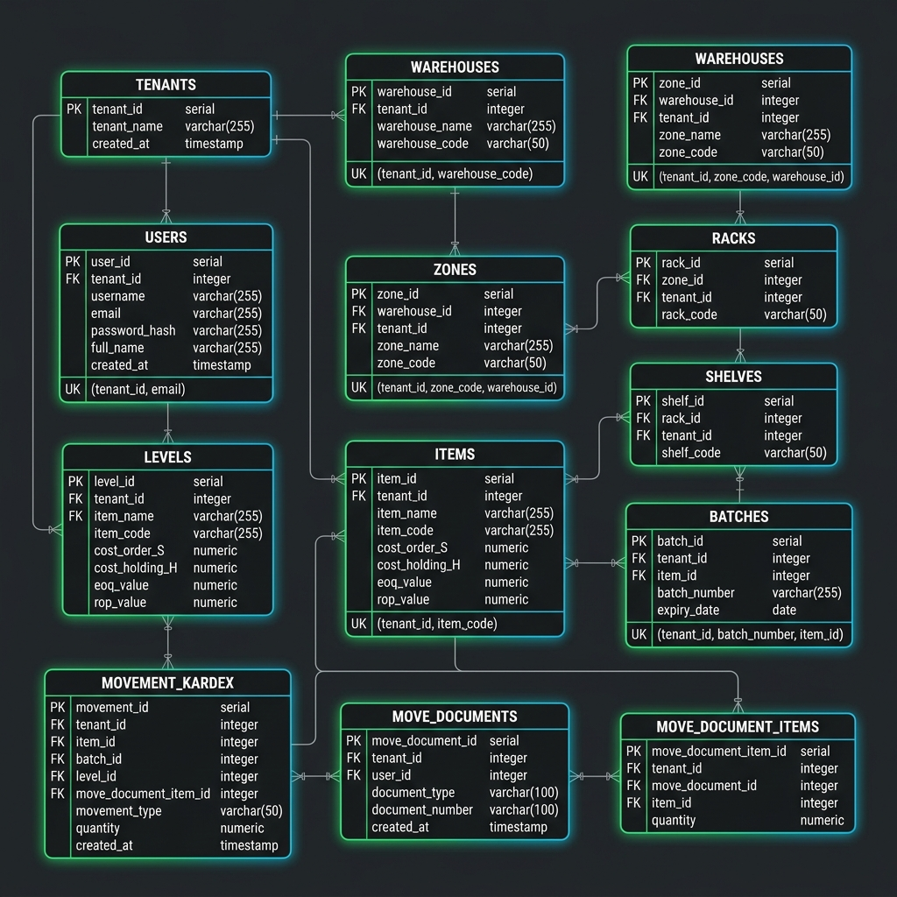
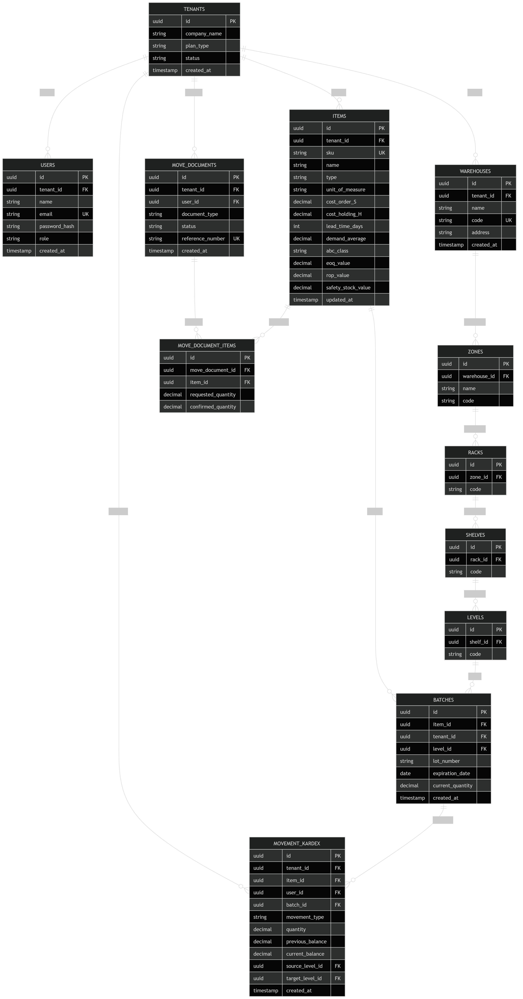
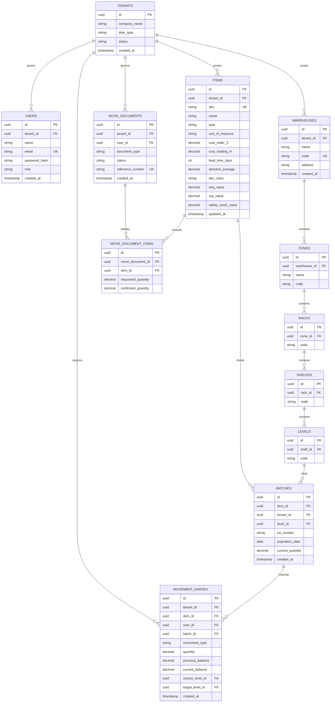

# Modelo de Datos Relacional y Multitenant
**Proyecto:** Krevo SaaS - Warehouse Management System (WMS)
**Fase:** Corte 1 (Análisis y Arquitectura Base)

Este documento detalla el diseño de la base de datos central de **Krevo WMS SaaS** soportada en **PostgreSQL**. A continuación se presentan el Diagrama Entidad-Relación y el Diccionario de Datos detallado, demostrando la estructura interna de almacenamiento, la jerarquía espacial de almacenamiento, las variables de costeo y planificación logística (Modelo Q/P), y la estrategia técnica para garantizar el aislamiento multi-tenant a nivel de esquema lógico.

---

## 1. Diagrama Entidad-Relación (ERD)



### Diagrama de Referencia de Base de Datos (Estructural dbdiagram.io)


> [!TIP]
> **Versión PDF Interactiva:** Si deseas visualizar, hacer zoom o navegar de forma vectorial e interactiva por cada entidad y relación del modelo de datos de Krevo, puedes abrir el archivo directo [base-de-datos.pdf](file:///C:/Users/ByArc/Desktop/krevo-saas/docs/base-de-datos.pdf).

<details>
<summary>📐 Ver Código Fuente del Diagrama (Mermaid)</summary>


</details>

---

## 2. Diccionario de Datos Detallado

### A. Entidades del Negocio SaaS y Multi-tenant

#### Tabla: `Tenants`
Almacena las empresas registradas bajo el modelo SaaS. Representa la frontera máxima del aislamiento lógico de datos.

| Atributo | Tipo de Dato | Claves / Restricciones | Descripción |
| :--- | :--- | :--- | :--- |
| `id` | UUID | PK | Identificador único global e inmutable del tenant. |
| `company_name` | VARCHAR(150) | NOT NULL | Nombre comercial de la empresa cliente. |
| `plan_type` | VARCHAR(20) | NOT NULL (Enum) | Plan contratado: `Basic`, `Pro`, `Enterprise`. Limita características operativas. |
| `status` | VARCHAR(20) | NOT NULL (Enum) | Estado de la suscripción: `Active`, `Suspended` (congelamiento de escritura por morosidad). |
| `created_at` | TIMESTAMP | DEFAULT NOW() | Fecha y hora de creación de la cuenta corporativa. |

#### Tabla: `Users`
Contiene la información de los usuarios del sistema. Cada usuario pertenece estrictamente a un único Tenant.

| Atributo | Tipo de Dato | Claves / Restricciones | Descripción |
| :--- | :--- | :--- | :--- |
| `id` | UUID | PK | Identificador único del usuario. |
| `tenant_id` | UUID | FK -> Tenants.id | Llave foránea del tenant al que pertenece. Indexado. |
| `name` | VARCHAR(100) | NOT NULL | Nombre completo del usuario. |
| `email` | VARCHAR(150) | UK, NOT NULL | Correo de acceso único global. |
| `password_hash`| VARCHAR(255) | NOT NULL | Contraseña encriptada utilizando bcrypt con salt dinámico. |
| `role` | VARCHAR(30) | NOT NULL (Enum) | Rol RBAC: `AdminTenant`, `JefeAlmacen`, `OpRecepcion`, `OpDespacho`. |
| `created_at` | TIMESTAMP | DEFAULT NOW() | Fecha de creación del registro. |

---

### B. Estructura Jerárquica del CEDI (Core Logístico)

Esta cadena jerárquica modela la parametrización espacial del almacén, permitiendo rastrear exactamente dónde se encuentra cada producto a nivel tridimensional (Bodega, Zona, Estante/Rack, Pasillo/Shelf, Nivel).

```
[Bodega] ──> [Zona] ──> [Rack] ──> [Shelf] ──> [Level] (Bin Location Coordenada)
```

#### Tabla: `Warehouses` (Bodegas)
| Atributo | Tipo de Dato | Claves / Restricciones | Descripción |
| :--- | :--- | :--- | :--- |
| `id` | UUID | PK | Identificador único de la bodega. |
| `tenant_id` | UUID | FK -> Tenants.id | Llave de aislamiento de empresa. |
| `name` | VARCHAR(100) | NOT NULL | Nombre de la bodega (ej. "Bodega Principal Alimentos"). |
| `code` | VARCHAR(20) | UK, NOT NULL | Código único para mapeos (ej. `BG01`). |
| `address` | VARCHAR(200) | NOT NULL | Dirección física de la bodega. |

#### Tabla: `Zones` (Zonas de Bodega)
| Atributo | Tipo de Dato | Claves / Restricciones | Descripción |
| :--- | :--- | :--- | :--- |
| `id` | UUID | PK | Identificador único de la zona. |
| `warehouse_id` | UUID | FK -> Warehouses.id | Referencia de la bodega contenedora (Restricción RESTRICT). |
| `name` | VARCHAR(50) | NOT NULL | Nombre descriptivo (ej. "Zona Fríos", "Zona Secos"). |
| `code` | VARCHAR(10) | NOT NULL | Código abreviado de la zona (ej. `ZN_FR`). |

#### Tabla: `Racks` (Estantes / Racks)
| Atributo | Tipo de Dato | Claves / Restricciones | Descripción |
| :--- | :--- | :--- | :--- |
| `id` | UUID | PK | Identificador único del estante. |
| `zone_id` | UUID | FK -> Zones.id | Referencia de la zona donde se ubica. |
| `code` | VARCHAR(10) | NOT NULL | Código numérico o de letra del rack (ej. `RK_A`). |

#### Tabla: `Shelves` (Pasillos / Estantes Horizontales)
| Atributo | Tipo de Dato | Claves / Restricciones | Descripción |
| :--- | :--- | :--- | :--- |
| `id` | UUID | PK | Identificador único de la sección del rack. |
| `rack_id` | UUID | FK -> Racks.id | Referencia del Rack principal. |
| `code` | VARCHAR(10) | NOT NULL | Código del pasillo/estante (ej. `SH_03`). |

#### Tabla: `Levels` (Niveles del Estante - Bin Locations)
| Atributo | Tipo de Dato | Claves / Restricciones | Descripción |
| :--- | :--- | :--- | :--- |
| `id` | UUID | PK | Identificador único del nivel de almacenamiento. |
| `shelf_id` | UUID | FK -> Shelves.id | Referencia del pasillo/estante contenedor. |
| `code` | VARCHAR(10) | NOT NULL | Identificador del nivel (ej. `LV_02`). |

> **Nota Logística:** La coordenada física completa de almacenamiento (Bin Location) se obtiene mediante la concatenación jerárquica para guiar de forma mobile-first al operario. Ejemplo: `BG01-ZN_FR-RK_A-SH_03-LV_02`.

---

### C. Catálogo de Artículos y Parámetros Logísticos

#### Tabla: `Items` (SKUs - Catálogo Maestro)
Contiene la definición técnica de los productos, diferenciando políticas lógicas y campos obligatorios de costo/tiempos de entrega para los cálculos automáticos del motor WMS (Modelos Q y P, análisis ABC, stock de seguridad).

| Atributo | Tipo de Dato | Claves / Restricciones | Descripción |
| :--- | :--- | :--- | :--- |
| `id` | UUID | PK | Identificador único del artículo. |
| `tenant_id` | UUID | FK -> Tenants.id | Llave de aislamiento de empresa. |
| `sku` | VARCHAR(50) | UK, NOT NULL | Código de barras único para escaneo físico (ej. `SKU-770123456`). |
| `name` | VARCHAR(150) | NOT NULL | Descripción del artículo (ej. "Arequipe 250g", "Tapas Plásticas"). |
| `type` | VARCHAR(30) | NOT NULL (Enum) | Tipo: `MateriaPrima`, `Insumo` (modelo probabilístico), `ProductoTerminado` (rotación FEFO). |
| `unit_of_measure` | VARCHAR(30) | NOT NULL | Unidad base y conversión (ej. "Caja x 24 Unidades", "Estiba"). |
| `cost_order_S` | DECIMAL(12,2) | NOT NULL, >= 0 | **S:** Costo administrativo de hacer un pedido de compra o de lanzar un lote de producción. |
| `cost_holding_H` | DECIMAL(12,2) | NOT NULL, >= 0 | **H:** Costo anualizado de mantener una unidad de este artículo almacenada en el CEDI. |
| `lead_time_days` | INT | NOT NULL, >= 0 | Tiempo de entrega promedio del proveedor medido en días naturales. |
| `demand_average` | DECIMAL(12,2) | NOT NULL, >= 0 | Demanda (salidas) promedio diaria calculada dinámicamente con base en el historial mensual. |
| `abc_class` | VARCHAR(1) | Nullable (Enum) | Clasificación de Pareto recalculada mensualmente: `A`, `B` o `C`. |
| `eoq_value` | DECIMAL(12,2) | Nullable, >= 0 | Cantidad Óptima de Pedido (EOQ) calculada según modelo de lote económico. |
| `rop_value` | DECIMAL(12,2) | Nullable, >= 0 | Punto de Reorden dinámico (ROP) que activa las alertas automáticas de compra. |
| `safety_stock_value`| DECIMAL(12,2)| Nullable, >= 0 | Stock de seguridad calculado matemáticamente basado en la variabilidad de la demanda y nivel de servicio. |
| `updated_at` | TIMESTAMP | DEFAULT NOW() | Fecha del último cálculo de reorden e inventario ABC. |

---

### D. Control de Existencias y Trazabilidad (Kárdex y Lotes)

#### Tabla: `Batches` (Lotes de Inventario en Ubicación)
Soporta el control físico del stock en las ubicaciones del CEDI. Implementa de forma ineludible las políticas FEFO/FIFO mediante campos de fecha de vencimiento y número de lote.

| Atributo | Tipo de Dato | Claves / Restricciones | Descripción |
| :--- | :--- | :--- | :--- |
| `id` | UUID | PK | Identificador único de este inventario en lote. |
| `tenant_id` | UUID | FK -> Tenants.id | Llave de aislamiento de empresa. |
| `item_id` | UUID | FK -> Items.id | Referencia del producto en cuestión. |
| `level_id` | UUID | FK -> Levels.id | **Bin Location:** El nivel específico donde descansa físicamente el lote. |
| `lot_number` | VARCHAR(50) | NOT NULL | Número de lote inyectado por el proveedor o por producción (ej. `LT-9823`). |
| `expiration_date` | DATE | Nullable | **FEFO:** Fecha de caducidad obligatoria para alimentos y perecederos. El sistema prioriza la salida de los lotes más próximos a vencer. |
| `current_quantity` | DECIMAL(12,2)| NOT NULL, >= 0 | Cantidad actual disponible de unidades de este lote en esta coordenada física. |
| `created_at` | TIMESTAMP | DEFAULT NOW() | Fecha de ingreso original del lote al CEDI. |

#### Tabla: `Movement_Kardex` (Historial Inmutable)
El Kárdex digital registra cada alteración física de inventario para fines de auditoría logística. Su diseño es de tipo **Solo Escritura** (las filas son inmutables).

| Atributo | Tipo de Dato | Claves / Restricciones | Descripción |
| :--- | :--- | :--- | :--- |
| `id` | UUID | PK | Identificador único del movimiento de kárdex. |
| `tenant_id` | UUID | FK -> Tenants.id | Llave de aislamiento de empresa. |
| `item_id` | UUID | FK -> Items.id | Producto transado. |
| `user_id` | UUID | FK -> Users.id | Operario o jefe que autorizó y ejecutó el movimiento (Logs de auditoría). |
| `batch_id` | UUID | FK -> Batches.id | Lote involucrado en la transacción. |
| `movement_type` | VARCHAR(30) | NOT NULL (Enum) | Tipo de movimiento: `Inbound` (Recepción), `Outbound` (Despacho), `Transfer` (Traslado de ubicación), `Adjustment` (Ajustes de inventario físico). |
| `quantity` | DECIMAL(12,2) | NOT NULL, > 0 | Cantidad de unidades transadas. |
| `previous_balance` | DECIMAL(12,2) | NOT NULL | Saldo total que tenía el producto en el CEDI antes de la transacción. |
| `current_balance` | DECIMAL(12,2) | NOT NULL | Saldo final exacto posterior a la transacción. |
| `source_level_id` | UUID | FK -> Levels.id (Null) | Origen físico (Null para entradas / Inbound). |
| `target_level_id` | UUID | FK -> Levels.id (Null) | Destino físico (Null para salidas / Outbound). |
| `created_at` | TIMESTAMP | DEFAULT NOW() | Marca de tiempo exacta del movimiento (Auditoría). |

---

### E. Operaciones de Bodega (Inbound / Outbound / Pre-alistamiento)

#### Tabla: `Move_Documents` (Documentos Soporte de Movimientos)
Registra las solicitudes de movimiento interno, órdenes de recepción u órdenes de entrega para clientes. Implementa los estados lógicos de flujo de trabajo.

| Atributo | Tipo de Dato | Claves / Restricciones | Descripción |
| :--- | :--- | :--- | :--- |
| `id` | UUID | PK | Identificador único del documento. |
| `tenant_id` | UUID | FK -> Tenants.id | Llave de aislamiento de empresa. |
| `user_id` | UUID | FK -> Users.id | Creador de la orden (ej. Supervisor de Producción). |
| `document_type` | VARCHAR(30) | NOT NULL (Enum) | Tipo: `Requisition` (Traslado interno de insumos), `InboundOrder` (Compra/Entrada), `OutboundOrder` (Despacho a clientes). |
| `status` | VARCHAR(30) | NOT NULL (Enum) | Estado: `Draft` (Edición), `Reserved` (Stock bloqueado para evitar doble toma), `Picking` (Operario recolectando), `Dispatched` (En tránsito), `Closed` (Culminado exitosamente). |
| `reference_number` | VARCHAR(50) | UK, NOT NULL | Código único de referencia (ej. `REQ-2026-0045`). |
| `created_at` | TIMESTAMP | DEFAULT NOW() | Fecha de registro inicial. |

#### Tabla: `Move_Document_Items` (Detalle de Documentos)
| Atributo | Tipo de Dato | Claves / Restricciones | Descripción |
| :--- | :--- | :--- | :--- |
| `id` | UUID | PK | Identificador único del item de la orden. |
| `move_document_id`| UUID | FK -> Move_Documents.id | Documento de cabecera (Restricción CASCADE al eliminar borradores). |
| `item_id` | UUID | FK -> Items.id | SKU requerido. |
| `requested_quantity`| DECIMAL(12,2)| NOT NULL, > 0 | Cantidad lógica solicitada originalmente por producción/compras. |
| `confirmed_quantity`| DECIMAL(12,2)| NOT NULL, >= 0 | Cantidad física confirmada recolectada/recibida en bodega por el operario. |

---

## 3. Restricciones de Integridad y Mecanismo de Aislamiento de Datos

Para que la base de datos sea robusta e impida fallos catastróficos, se configuran las siguientes directrices y restricciones a nivel de motor PostgreSQL:

1.  **Restricción de Borrado (`RESTRICT`):**
    *   No se permite la eliminación de filas en tablas padre como `Items`, `Levels`, `Warehouses` o `Users` si existen registros asociados en las tablas transaccionales de trazabilidad (`Batches`, `Movement_Kardex`, `Move_Document_Items`). El motor de base de datos Postgres abortará automáticamente la petición con un error de violación de llave foránea.
2.  **Garantía Multi-tenant (Indices Compuestos):**
    *   Se implementan índices compuestos en todas las tablas transaccionales combinando el `tenant_id` con el identificador del registro. Ejemplo de índice en PostgreSQL:
        ```sql
        CREATE UNIQUE INDEX idx_batches_id_tenant ON "Batches" (id, tenant_id);
        ```
    *   Esto garantiza que el ORM Prisma filtre el 100% de las consultas e inserciones utilizando tanto la clave primaria como el `tenant_id` recuperado del JWT. Evita que un programador que omita la cláusula `where` en código exponga registros de otros clientes, pues la consulta forzará la partición lógica del índice compuesto en el plan de ejecución de PostgreSQL.
3.  **Transaccionalidad Estricta en Inventarios:**
    *   Cada cambio de stock en la tabla `Batches` y la inserción del correspondiente registro de kárdex en `Movement_Kardex` se ejecutan dentro de bloques de transacciones SQL (`BEGIN ... COMMIT`). Si la inserción del kárdex falla (por ejemplo, por una restricción de clave o tipo de dato erróneo), el motor realiza un `ROLLBACK` completo en el lote para que la cantidad de stock no quede desbalanceada de su estado original.
